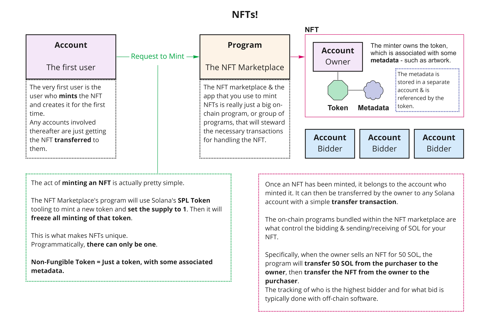

## Setup from Scratch

```shell
npm init
npm i @solana/spl-token @solana/web3.js mz ts-node yaml
npm i --save-dev @types/mz
```

Change the script in `package.json` from "test" to:
```json
"app": "ts-node ./app.ts"
```

Create the Rust crate:
```shell
cargo new --lib mint
```

Now write your Rust and TypeScript code!   
   
Deploy with:
```shell
cargo build-bpf --manifest-path=./mint/Cargo.toml --bpf-out-dir=./dist/program
solana program deploy dist/program/mint.so
```
Run with:
```shell
npm run app
```

## Setup from Cloning this Repo

```shell
npm i
bash build.sh
npm run app
```


## About NFTs


